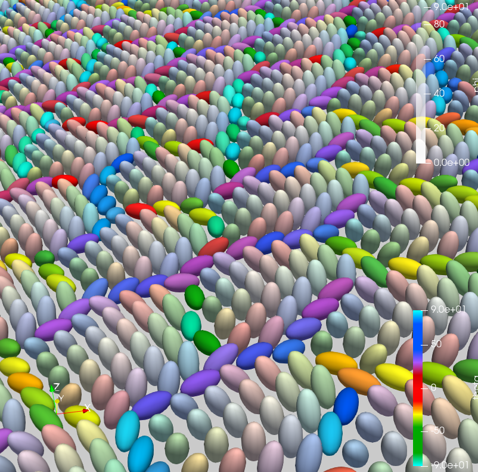
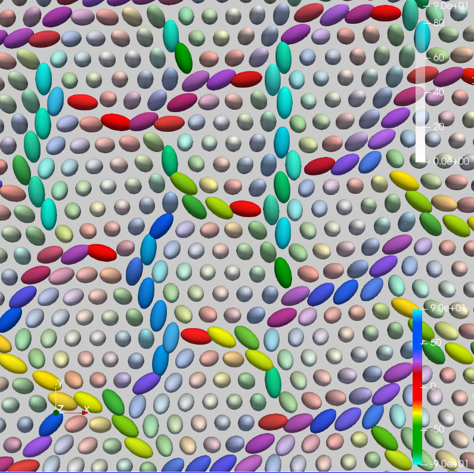

# Overview
One of the goals of the project is to enable researchers to visualize the result of molecular dynamic(MD) simulation easily with Paraview. 

  
   

## User Manual
1. [Overview](user_manual/Overview.pdf) 
2. [Adapt your dataset for visualization](user_manual/Adapt_your_dataset_for_visualization.pdf)
3. [Express an ellipsoid in vtk format](user_manual/express_ellipsoid_in_vtk_format.pdf)
4. [Color of an ellipsoid](user_manual/Color_of_the_particles.pdf)
5. [Extract certain ellipsoidss](user_manual/extract_certain_particles.pdf)
6. [Paraview GUI commands](user_manual/Paraview_GUI_commands.pdf)
7. [Resources](user_manual/Resources.pdf)

## Breakdown of directories

`data` - where input data need to be stored

`Paraview_macro` - python macro can be loaded and run in Paraview. Detail on macros is on [this page](skyrmion-visualisation/user_manual/Paraview_GUI_commands.pdf) 

`utils` - contains helper functions to process dataframe, converting vtk file etc

## Command to run

1. `git clone [https://gitlab.com/amorphousmlops/skyrmion-visualisation.git](https://gitlab.com/amorphousmlops/skyrmion-visualisation.git)` 
2. `python pipeline.py --input_dir <data>` and generate vtk file
### If you want to see the cross section of the system using plane
 `python pipeline.py --input_dir <path/to/data/dir/> --plane_grad <a b c d> --plane_width <w> --plane_origin <x0 y0 z0>` where `<>` is a placeholder
### example
 `python pipeline.py --input_dir data --plane_grad 2 -1 0 1 --plane_width 1 --plane_origin 0 0 0`  
3. load macro `visualiseVTK.py` on Paraview
4. run [`visualiseVTK.py`](http://visualiseVTK.py) on Paraview

### utils/dat2df.py needs to be modified for the simulation data
dat2df.py outputs a dataframe. In order for the program to process the dataframe, dataframe must contain a header about location of the center of an ellipsoid (rx, ry, rz) and a vector expressing its long axis (nx, ny, nz)

e.g. header = [”rx”, “ry”, “rz”, “nx”, “ny” ,“nz”]
more detail on [this page](skyrmion-visualisation/user_manual/Adapt_your_dataset_for_visualization.pdf)

## Arguments

`input_dir` - path to the directory containing input data

`vtk_dir` - path to store output vtk files

`save_csv` - If ‘on’, the program saves the processed dataframes into csv file

`video` - If ‘on’, the program creates a .vtk.series file which combines all the vtk files, which can be animated in Paraview

`scale` - Scale determines the radius of particles. This parameter is used unless scale is not specified in dataframe for each particles. Every particle will have the same scale in this way.

`ratio` - Ratio determines the shape of particles. The parameter is the ratio of the long and short axis(long/short), which are the length of the eigenvectors. This parameter is used unless ratio is not specified in dataframe for each particles. Every particle will have the same ratio in this way

**Plane equation:** $a\cdot (x-x0) + b\cdot (y-y0) +c\cdot (z-z0) +d =0$

more detail on [this page](skyrmion-visualisation/user_manual/extract_certain_particles.pdf)

`plane_grad` - parameter a, b, c, d to define the gradient of the plane

`plane_width` - width of 2 planes cutting the 3D particle models. If not defined, it becomes the same as the radius of the particle(scale)

`plane_origin` - origin of the plane x0, y0, z0, default value is 0, 0, 0

## **packages required**

- numpy
- pandas